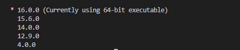
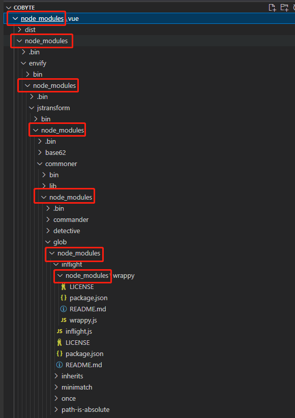

# 从 Vue3 源码入门理解 pnpm 的 monorepo 到以 pnpm 构建 monorepo 环境搭建组件库工程化实战

什么是 Monorepo ?
Monorepo 其实不是一个新的概念，在软件工程领域，它已经有着十多年的历史了。概念上很好理解，就是把多个项目放在一个仓库里面，相对立的是传统的 MultiRepo 模式，即每个项目对应一个单独的仓库来分散管理。

vue3 组件库 monorepo 环境搭建


使用 monorepo 环境的好处就是可以在一个项目中管理多个仓库，可以达到仓库之间的资源共享。比如我们在新建组件的时候，可能有组件的文档，包括组件的测试，那他们，可能都是一个个的仓库，那这样的话，我们可以在一个项目下，管理这些仓库，可以达到仓库之间的一个资源共享，那包括，我们还可以，在一个仓库下，管理所有的这个仓库进行发布和部署。那当然了，我们每一个组件，其实也是可以单独发布和部署的，所以这里，我们会采用这种 monorepo 的方式，来搭建我们的组件库。
我们这里，采用这个 pnpm 来进行这个 monorepo 的一个环境搭建，那 pnpm 的它的特点，主要它的好处就是速度快，还有，就是我们的磁盘利用率高，而且，使用这个 pnpm 来搭建我们的这个 monorepo 环境，是非常的容易的，我们可以快速的去搭建出这样一个 monorepo 环境。


首先要进行全局安装 pnpm
```
npm install pnpm -g
```

然后在项目下使用 pnpm init 进行 package.json 的初始化。这跟 npm init 是一样的。
```
pnpm init
```
然后把 package.json 中的 name 属性删掉，并且添加一个 `"private": true` 属性，因为它是不需要发布的。


配置 pnpm 的 monorepo 环境

```
pnpm-workspace.yaml
```
可以在 pnpm-workspace.yaml 配置文件中指定这个仓库中有多少个包

```
packages:
  - play # 存放组件测试的代码
  - docs # 存放组件文档
  - packages/* # packages 目录下都是包
```


```
pnpm install @cobyte/components -w

pnpm install @cobyte/theme-chalk -w

pnpm install @cobyte/utils -w
```

接下来安装一些我们所需的依赖。

```
pnpm install vue typescript @types/node -D -w
```
因为 `vue` 、 `typescript` 和 `@types/node`  只是开发环境需要的，所以安装的时候需要添加一个 `-D` 参数表示安装到开发环境，`-w` 表示安装到共公模块的 packages.json 中，也就是根目录下的 packages.json。

TypeScript 初始化配置文件
因为我们使用了 TypeScript，这样我们想要去校验我们的代码，让我们代码有提示，并且可以按照一些规则来解析我们的语法，给我们更友好的提示，我们就需要去初始化一下这个 TypeScript 配置命令。
又因为我们安装了 typescript，所以在 `node_modules` 目录下 `bin` 目录里面就会存在一个 tsc 的命令，这个命令，就可以帮我们进行初始化，我们可以使用 `npm tsc --init` 来初始化，也可以使用 `pnpm tsc --init` 那么执行这个命令，它就会去 `node_modules` 目录下 `bin` 目录找这个 tsc 命令进行执行。

```
pnpm tsc --init
```


```
pnpm create vite play --template vue-ts
```

通过 JavaScript 实现 BEM 规范


```
pnpm install unplugin-vue-define-options -D -w
```

### 幽灵依赖的前世今生

shamefully-hoist = true 幽灵依赖
“幽灵依赖” 指的是 项目中使用了一些没有被定义在项目中的 package.json 文件中的包。
我们首先要搞清清楚幽灵依赖是怎么来的，要从 npm 的包管理器的历史说起

我们先通过 nvm 的 node 版本管理工具把 node 版本回退到 node4.0版本
```
nvm install 4.0.0
```
然后在安装对应版本的 npm 包的时候，报错了。


然后我们通过 npm 的淘宝源的镜像地址进行手动下载安装。

 

 npm 的淘宝源的镜像地址[传送门](https://registry.npmmirror.com/binary.html?path=node/npm/)。同时在这个地址上也可以手动下载 node 其他版本的包，然后进行手动设置。

然后对下载好的 npm 包进行解压。
 

然后复制到对应的 nvm 目录中对应的 node 包目录下。

 

可以看到我的 nvm 目录下存在很多过版本的 node 目录了，因为我安装了很多个不同版本的 node，那么我们现在需要把刚刚下载解压之后的 npm 包复制到 v4.0.0 的目录中。

 

这个时候我们就可以看到 node4 的版本目录 v4.0.0 中就存在了一个 npm.cmd 文件，这个是就 npm 的命令文件。

至此我们的 Node4 的版本环境就设置完毕了，我们通过 nvm ls 命令查看所有的 node 版本的时候，我们可以看到出现 4.0.0 版本了。
 

然后我们通过 nvm use 4.0.0 命令进行切换 Node4 的版本。

我们再次通过 nvm ls 命令查看所有的 node 版本的时候，我们可以看到出现 4.0.0 版本是当前正在使用的版本了。

 

我们通过 node -v 查看。

 

我们通过 npm -v 查看。

 

 我们可以看到我们的环境已经成功设置为 Node 版本为 4.0， npm 版本为 1.4.9 版本了。

注意：我上述设置是在 windows 环境下设置的，mac 的同学也可以进行相同的设置。

这个时候我们随便找一个目录进行 package 初始化： `npm init -y` ，接着安装一个 Vue1，`npm install vue@1.0.0`。

 

我们可以到首先项目本身有一个 `node_modules` 目录，然后 Vue1 也有一个 `node_modules` 目录，然后 Vue1 里的一些包的目录底下也存在 `node_modules` 目录，就是一个不断套娃的状况。

这样回导致如果多个包之间存在相同的依赖的话，那么即便是同一个依赖包也要进行多次复制存储起来，造成磁盘空间浪费。而且嵌套过深的话，同时会造成路径过长，而 windows 的文件路径是有长度限制的，所以嵌套过深目录路径可能会超出限制。

在 npm 升级到版本 3 的时候，就参考了社区的 yarn 包管理器的解决方案。将所有的依赖进行平铺，不再一层一层进行嵌套了，这样重复的依赖也只剩一个了，同时也不会存在路径过长的问题。

这同时又带来了本章节要进行介绍的**幽灵依赖**的问题。因为所有的依赖都进行平铺了，所以依赖的依赖，也可以进行引用使用了。也就是一些没有被定义在项目中的 package.json 文件中的包，也可以进行导入使用了。但又因为没有显式在 packages 中进行声明引用，将来有一天你引用的那个主包不再使用了，而你的项目中还引用着它包中的依赖，自然就会出错了。这个就是幽灵依赖会导致的问题。

下面我们进行实操一下，我们先把我们的 node 环境通过 nvm 管理工具切换成现在常用的版本，node12 以后。我们安装一下我们常用的 echarts 包。

```
npm install echarts
```

然后我们再去看看 `node_modules` 目录。

 

然后我们发现除了我们安装的 `echarts` 包之外，还多了两个包：tslib、zrender。

- tslib 这是的运行时库，其中包含所有 TypeScript 辅助函数。 
- zrender.js 是可视化框架 Echarts.js 的 2D 绘制引擎，支持 canvas\svg\vml 等多种渲染方式。

那么就意味着我们不需要再手动 npm install 进行安装，就可以引入使用了。


那么有一天当我们不再需要使用 echarts 这个包的时候，我们从项目的 package.json 文件中依赖声明中删除之后，那么我们如果在项目中引用了 zrender.js 就会报错，因为 zrender 包会随着主包 echarts 的删除而删除了。

幽灵依赖的这个问题，随着最近火热的 pnpm 新一代的包管理器的出现而得到解决。
我们删除刚刚安装 echarts 包出现的 `node_modules` 目录，然后重新使用 pnpm 进行安装。

```
pnpm install echarts
```
然后我们再看看项目中的 `node_modules` 目录结构。

 

我们发现只剩下一个我们手动安装的 echarts 包的目录和一个 .pnpm 的目录，而刚才通过 npm 安装出现的 tslib、zrender 包则不见了。

然后我们展开 .pnpm 目录中 `node_modules` 目录，则发现了 tslib、zrender 包。

 

这样一来我们就清楚了，项目的 package.json 文件中显示声明的依赖则会平铺在 `node_modules` 根目录下，而依赖中依赖则放在 `node_modules` 根目录下的 .pnpm 的目录中 `node_modules` 目录下。这样由于 tslib、zrender 包没有直接暴露在 `node_modules` 根目录下，则项目中就不能再进行引用使用了，这样也就解决了幽灵依赖的问题。

我们在 element-plus 项目根目录下发现了一个名叫：`.npmrc` 文件，里面的内容则是：

```
shamefully-hoist = true
```

那么这个配置的作用是什么呢？我们在 pnpm 的官网中找到了答案了。

 我们在 pnpm 的官网中找到了这么一段内容。

意思就说有一些工具包在 pnpm 的默认设置下是无法运行的，必须把虚拟仓库中的依赖进行提升到 `node_modules` 根目录下。