# Element Plus 组件库核心技术揭秘：幽灵依赖的前世今生

shamefully-hoist = true 幽灵依赖
“幽灵依赖” 指的是 项目中使用了一些没有被定义在项目中的 package.json 文件中的包。
我们首先要搞清清楚幽灵依赖是怎么来的，要从 npm 的包管理器的历史说起

我们先通过 nvm 的 node 版本管理工具把 node 版本回退到 node4.0版本
```
nvm install 4.0.0
```
然后在安装对应版本的 npm 包的时候，报错了。

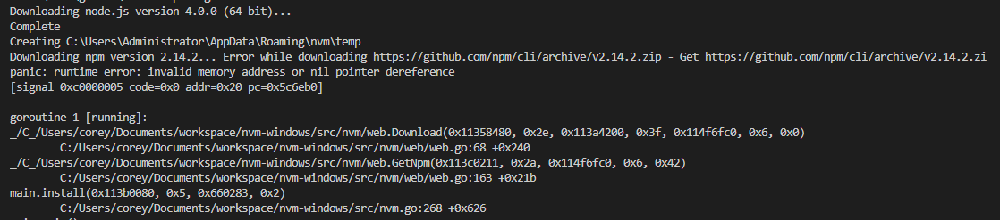

然后我们通过 npm 的淘宝源的镜像地址进行手动下载安装。

 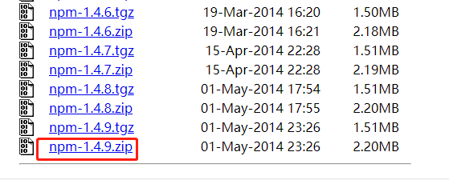

 npm 的淘宝源的镜像地址[传送门](https://registry.npmmirror.com/binary.html?path=node/npm/)。同时在这个地址上也可以手动下载 node 其他版本的包，然后进行手动设置。

然后对下载好的 npm 包进行解压。
 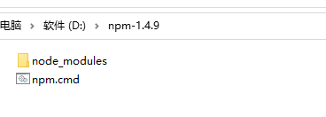

然后复制到对应的 nvm 目录中对应的 node 包目录下。

 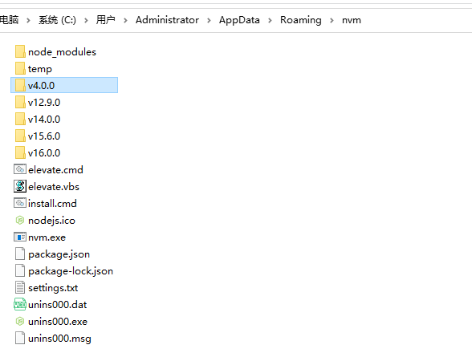

可以看到我的 nvm 目录下存在很多过版本的 node 目录了，因为我安装了很多个不同版本的 node，那么我们现在需要把刚刚下载解压之后的 npm 包复制到 v4.0.0 的目录中。

 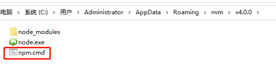

这个时候我们就可以看到 node4 的版本目录 v4.0.0 中就存在了一个 npm.cmd 文件，这个是就 npm 的命令文件。

至此我们的 Node4 的版本环境就设置完毕了，我们通过 nvm ls 命令查看所有的 node 版本的时候，我们可以看到出现 4.0.0 版本了。
 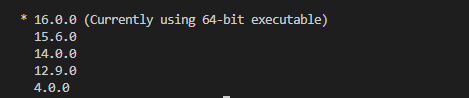

然后我们通过 nvm use 4.0.0 命令进行切换 Node4 的版本。

我们再次通过 nvm ls 命令查看所有的 node 版本的时候，我们可以看到出现 4.0.0 版本是当前正在使用的版本了。

 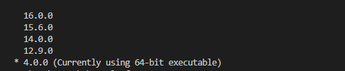

我们通过 node -v 查看。

 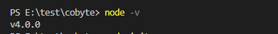

我们通过 npm -v 查看。

 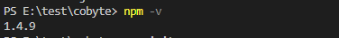

 我们可以看到我们的环境已经成功设置为 Node 版本为 4.0， npm 版本为 1.4.9 版本了。

注意：我上述设置是在 windows 环境下设置的，mac 的同学也可以进行相同的设置。

这个时候我们随便找一个目录进行 package 初始化： `npm init -y` ，接着安装一个 Vue1，`npm install vue@1.0.0`。

 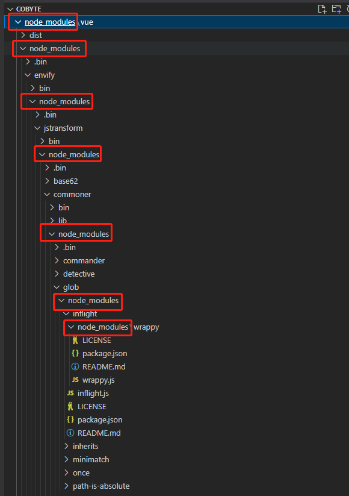

我们可以到首先项目本身有一个 `node_modules` 目录，然后 Vue1 也有一个 `node_modules` 目录，然后 Vue1 里的一些包的目录底下也存在 `node_modules` 目录，就是一个不断套娃的状况。

这样回导致如果多个包之间存在相同的依赖的话，那么即便是同一个依赖包也要进行多次复制存储起来，造成磁盘空间浪费。而且嵌套过深的话，同时会造成路径过长，而 windows 的文件路径是有长度限制的，所以嵌套过深目录路径可能会超出限制。

在 npm 升级到版本 3 的时候，就参考了社区的 yarn 包管理器的解决方案。将所有的依赖进行平铺，不再一层一层进行嵌套了，这样重复的依赖也只剩一个了，同时也不会存在路径过长的问题。

这样就不会造成大量包的重复安装，依赖的层级也不会太深，解决了依赖地狱问题，但也形成了新的问题。就是同时又带来了本章节要进行介绍的**幽灵依赖**的问题。因为所有的依赖都进行平铺了，所以依赖的依赖，也可以进行引用使用了。也就是一些没有被定义在项目中的 package.json 文件中的包，也可以进行导入使用了。但又因为没有显式在 packages 中进行声明引用，将来有一天你引用的那个主包不再使用了，而你的项目中还引用着它包中的依赖，自然就会出错了。这个就是幽灵依赖会导致的问题。

下面我们进行实操一下，我们先把我们的 node 环境通过 nvm 管理工具切换成现在常用的版本，node12 以后。我们安装一下我们常用的 echarts 包。

```
npm install echarts
```

然后我们再去看看 `node_modules` 目录。

 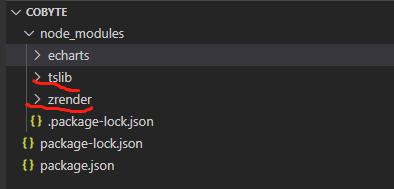

然后我们发现除了我们安装的 `echarts` 包之外，还多了两个包：tslib、zrender。

- tslib 这是的运行时库，其中包含所有 TypeScript 辅助函数。 
- zrender.js 是可视化框架 Echarts.js 的 2D 绘制引擎，支持 canvas\svg\vml 等多种渲染方式。

那么就意味着我们不需要再手动 npm install 进行安装，就可以引入使用了。

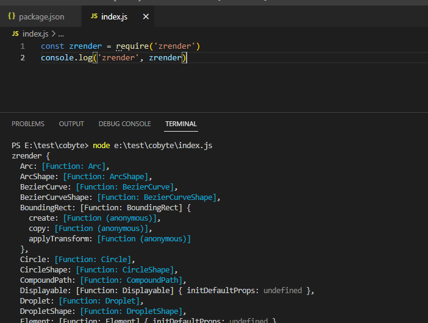

那么有一天当我们不再需要使用 echarts 这个包的时候，我们从项目的 package.json 文件中依赖声明中删除之后，那么我们如果在项目中引用了 zrender.js 就会报错，因为 zrender 包会随着主包 echarts 的删除而删除了。

幽灵依赖的这个问题，随着最近火热的 pnpm 新一代的包管理器的出现而得到解决。
我们删除刚刚安装 echarts 包出现的 `node_modules` 目录，然后重新使用 pnpm 进行安装。

```
pnpm install echarts
```
然后我们再看看项目中的 `node_modules` 目录结构。

 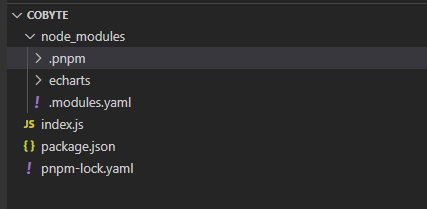

我们发现只剩下一个我们手动安装的 echarts 包的目录和一个 .pnpm 的目录，而刚才通过 npm 安装出现的 tslib、zrender 包则不见了。

然后我们展开 .pnpm 目录中 `node_modules` 目录，则发现了 tslib、zrender 包。

 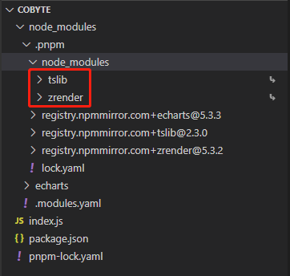

这样一来我们就清楚了，项目的 package.json 文件中显示声明的依赖则会平铺在 `node_modules` 根目录下，而依赖中依赖则放在 `node_modules` 根目录下的 .pnpm 的目录中 `node_modules` 目录下。这样由于 tslib、zrender 包没有直接暴露在 `node_modules` 根目录下，则项目中就不能再进行引用使用了，这样也就解决了幽灵依赖的问题。

 我们发现已经不能像之前那样不安装 zrender 包，也能进行引用使用了，这样一来就可以确保不会产生幽灵依赖的问题了。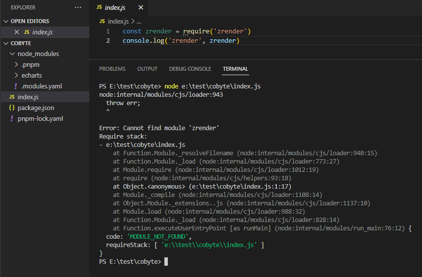

我们在 element-plus 项目根目录下发现了一个名叫：`.npmrc` 文件，里面的内容则是：

```
shamefully-hoist = true
```

那么这个配置的作用是什么呢？我们在 pnpm 的官网中找到了答案了。

 我们在 pnpm 的官网配置 .npmrc 的选项中找到了相关的说明。

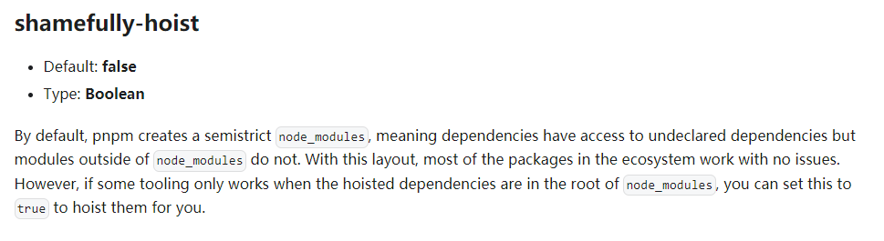

意思是：默认情况下，pnpm 创建半严格的 `node_modules`，这意味着在项目中可以访问未声明的依赖，但 `node_modules` 之外的模块不能访问。通过这种设置，大多数包都可以正常工作。但是，如果某些工具包需要将所有的依赖提升到位于 `node_modules` 的根目录中才起作用时，则可以将设置 `shamefully-hoist = true` 来提升所有的依赖。

另外我们也在 pnpm 的官网推荐的博客中也找到了相关介绍。

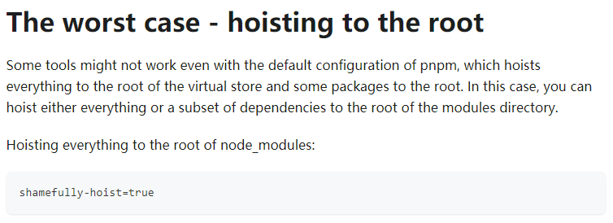

意思就说有一些工具包在 pnpm 的默认设置下是无法运行的，必须把虚拟仓库中的依赖进行提升到 `node_modules` 根目录下。

 我们按照官方的指引在项目根目录下添加一个 .npmrc 的文件，然后设置内容为 `shamefully-hoist = true`，然后再重新 pnpm install 安装依赖，然后我们发现  `node_modules` 根目录下又出现了 tslib、zrender 包目录。

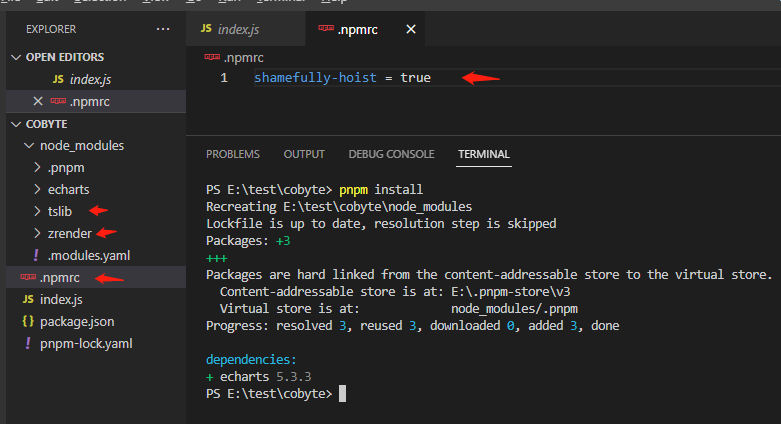

然后又可以像 npm 安装那样进行引用未在 package.json 里面进行声明的依赖了。

 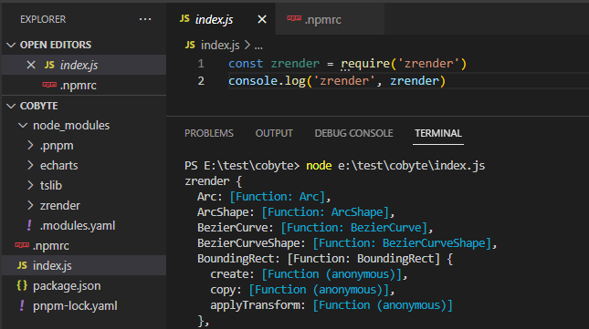


